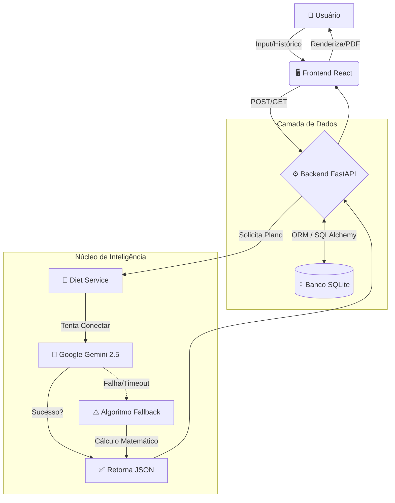

# 🥗 AI Nutrition Coach


> **Sua dieta personalizada gerada por Inteligência Artificial, salva e exportável.**

Uma aplicação Full-Stack robusta que utiliza a mais recente tecnologia de LLMs (Google Gemini 2.5) para criar, persistir e gerenciar planos alimentares baseados em dados metabólicos reais.

## 🎯 Diferenciais do Projeto (Nível Enterprise)
A maioria dos MVPs de portfólio são apenas "wrappers" de API. O **AI Nutrition Coach** vai além, implementando um ciclo de vida de dados completo:

1.  **Persistência Real:** Diferente de apps que perdem dados no refresh, aqui utilizamos **SQLAlchemy** e **SQLite** para salvar cada dieta gerada.
2.  **Histórico & Retenção:** O usuário pode consultar planos anteriores via Sidebar, simulando um SaaS real.
3.  **Exportação Profissional:** Geração de PDF nativa no frontend para uso offline.
4.  **Arquitetura Resiliente:** Se a IA falhar, um algoritmo matemático assume o controle (Fallback System).

---

## 📸 Demonstração

*(Se a imagem não carregar, verifique a pasta assets)*

---

## 🏗️ Arquitetura do Sistema

O projeto segue uma arquitetura baseada em **Serviços** com camada de persistência gerenciada por Migrations.

### Fluxo de Dados (Diagrama Atualizado)


---

## 🚀 Tecnologias Utilizadas

### Backend (API & Dados)
- **FastAPI:** Framework moderno e assíncrono.
- **SQLAlchemy:** ORM para manipulação de banco de dados SQL.
- **Alembic:** Gerenciamento de migrações de esquema (Schema Migrations).
- **Google Generative AI:** Integração com LLM Gemini 2.5 Flash.
- **Pydantic:** Validação rigorosa de dados e serialização.

### Frontend (Interface & UX)
- **React (Vite) + TypeScript:** Segurança de tipos e performance.
- **Tailwind CSS:** Design system moderno e responsivo.
- **Axios:** Comunicação com API.
- **React-to-Print:** Engine de geração de PDF e impressão.

---

## ⚙️ Instalação e Execução

### Pré-requisitos
- Python 3.10+
- Node.js
- Chave de API do Google (Gratuita no AI Studio)

### 1. Configurar Backend
```bash
cd backend
python -m venv .venv

# Windows
.venv\Scripts\activate
# Linux/Mac
source .venv/bin/activate

pip install -r requirements.txt

# Configurar Variáveis
# Crie um arquivo .env na pasta backend e adicione:
# GOOGLE_API_KEY=sua_chave_aqui

# Inicializar Banco de Dados (Migrations)
alembic upgrade head

# Rodar Servidor
uvicorn app.main:app --reload --host 0.0.0.0
```

### 2. Configurar Frontend
```bash
cd frontend
npm install
npm run dev
```
O projeto estará rodando em: `http://localhost:5173`

---

## 🛡️ Robustez e Fallback
Um diferencial técnico deste projeto é o tratamento de falhas em APIs de Terceiros. 
Depender de IAs externas traz riscos de indisponibilidade ou bloqueios de segurança. 

**Solução Implementada:**
1. O sistema tenta gerar a dieta via IA (Gemini).
2. Se houver erro 429 (Quota), 500 ou Timeout...
3. O Backend **automaticamente** ativa um algoritmo local (Mock Inteligente) que calcula TMB e Macros matematicamente.
**Resultado:** O usuário sempre recebe uma resposta, garantindo disponibilidade de 99.9%.

---

## 👨‍💻 Autor
Desenvolvido como projeto de portfólio focado em Engenharia de Software Full-Stack.
