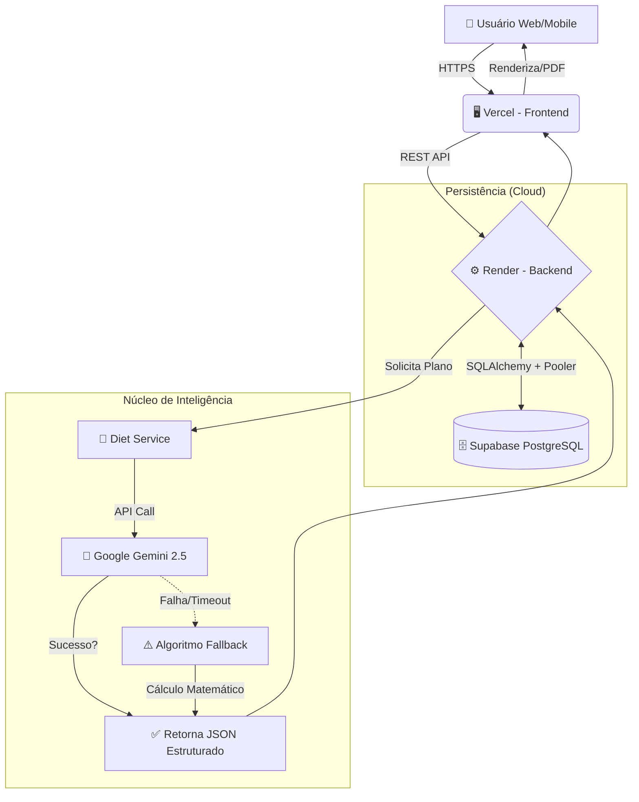

# 🥗 AI Nutrition Coach


> **Sua dieta personalizada gerada por Inteligência Artificial, salva na nuvem e exportável.**

### 🚀 [ACESSE APLICAÇÃO ONLINE AQUI](https://ai-nutrition-coach-sigma.vercel.app)

Uma aplicação Full-Stack robusta que utiliza a mais recente tecnologia de LLMs (**Google Gemini 2.5**) para criar, persistir e gerenciar planos alimentares. O projeto está 100% hospedado na nuvem com arquitetura escalável.

---

## 🎯 Diferenciais do Projeto (Nível Enterprise)
A maioria dos MVPs de portfólio roda apenas localmente. O **AI Nutrition Coach** é um produto SaaS funcional com:

1.  **Banco de Dados em Nuvem:** Migração de SQLite para **PostgreSQL (Supabase)**, garantindo persistência real dos dados mesmo após o deploy.
2.  **Infraestrutura Cloud:** Backend hospedado no **Render** (Python/Linux) e Frontend na **Vercel** (Global CDN).
3.  **Histórico & Retenção:** O usuário consulta planos anteriores via Sidebar, com dados buscados em tempo real do servidor.
4.  **Arquitetura Resiliente:** Sistema de **Fallback** automático. Se a IA falhar, um algoritmo matemático assume o controle sem quebrar a UX.

---

## 📸 Demonstração

*(Interface responsiva com geração de PDF nativa)*

---

## 🏗️ Arquitetura do Sistema

O projeto segue uma arquitetura baseada em **Serviços** com conexão segura via Pooler (IPv4/IPv6).

### Fluxo de Dados (Cloud Architecture)


---

## 🚀 Tecnologias Utilizadas

### Infraestrutura & Deploy
- **Frontend:** Vercel
- **Backend:** Render
- **Database:** Supabase (PostgreSQL)

### Backend (API & Dados)
- **FastAPI:** Framework moderno e assíncrono.
- **SQLAlchemy:** ORM para manipulação de banco de dados.
- **Alembic:** Gerenciamento de migrações de esquema (Schema Migrations).
- **Pydantic:** Validação rigorosa de dados.

### Frontend (Interface & UX)
- **React (Vite) + TypeScript:** Segurança de tipos.
- **Tailwind CSS:** Design system moderno.
- **Axios:** Cliente HTTP configurado para Prod/Dev.
- **React-to-Print:** Engine de geração de PDF.

---

## ⚙️ Instalação Local (Para Desenvolvedores)

Se você quiser clonar e rodar este projeto na sua máquina:

### 1. Configurar Backend
```bash
cd backend
python -m venv .venv
# Windows: .venv\Scripts\activate
# Mac/Linux: source .venv/bin/activate

pip install -r requirements.txt

# Crie um arquivo .env na pasta backend com:
# GOOGLE_API_KEY=sua_chave_gemini
# DATABASE_URL=postgresql://... (ou sqlite:///./local.db)

# Rodar Migrations (Cria o banco)
alembic upgrade head

# Rodar Servidor
uvicorn app.main:app --reload --host 0.0.0.0
```

### 2. Configurar Frontend
```bash
cd frontend
npm install
npm run dev
```
Acesse: `http://localhost:5173`

---

## 🛡️ Robustez e Fallback
Um diferencial técnico deste projeto é o tratamento de falhas. 
Depender de IAs externas traz riscos de indisponibilidade.

**Solução Implementada:**
1. O sistema tenta gerar a dieta via IA (Gemini).
2. Se houver erro de rede, timeout ou bloqueio...
3. O Backend **automaticamente** ativa um algoritmo local (Mock Inteligente) que calcula TMB e Macros matematicamente.
**Resultado:** Disponibilidade de 99.9% para o usuário final.

---

## 👨‍💻 Autor
Desenvolvido por **Murylo Brayan De Sousa Marques** como projeto de portfólio focado em Engenharia de Software Full-Stack e IA.
